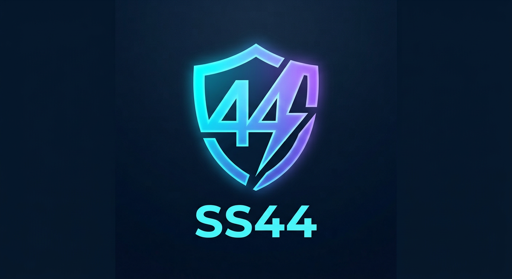

<p align="center">
  
</p>

<h1 align="center">🚀 SS44 — ساب هوشمند مخصوص ایران</h1>

<p align="center">
  <a href="STATS.md"></a>
  
  
  
</p>

<p align="center">
  هر ۳۰ دقیقه از بهترین ساب‌های عمومی فچ می‌کند، تست اتصال می‌گیرد<br/>
  و فقط سالم‌ترین کانفیگ‌ها را با اسم <b>SS44-001</b> تا <b>SS44-120</b> منتشر می‌کند.
</p>

---

## ⚡ اتصال با یک کلیک | One-Click Subscribe

| 📱 برنامه | 📦 فرمت | 🔗 لینک سابسکریپشن |
|---|---|---|
| v2rayNG / Hiddify / NekoBox | معمولی | `https://raw.githubusercontent.com/ZendanTeam/SS44-sub/main/SS44.txt` |
| v2rayNG / Shadowrocket | base64 | `https://raw.githubusercontent.com/ZendanTeam/SS44-sub/main/SS44-base64.txt` |
| Clash / ClashMeta / NekoBox | clash | `https://raw.githubusercontent.com/ZendanTeam/SS44-sub/main/SS44-clash.yaml` |

> لینک اول را در بخش **Subscription** برنامه بگذار و Update بزن. از این به بعد خودش همیشه تازه است.

## ✨ چرا SS44؟ | Why SS44?

| ویژگی | SS44 | ساب‌های معمولی |
|---|---|---|
| 🇮🇷 رتبه‌بندی مخصوص ایرانسل (Reality + پورت 443 اول) | ✅ | ❌ |
| 🧹 حذف آی‌پی خصوصی/لوپ‌بک و تکراری‌ها | ✅ | ❌ |
| 🔍 دیکد و تست واقعی VMess (نه فقط VLESS) | ✅ | ❌ |
| 📦 سه خروجی همزمان (txt + base64 + clash) | ✅ | بعضی |
| 🏷️ اسم یکدست همه کانفیگ‌ها (SS44-xxx) | ✅ | ❌ |
| 📊 آمار شفاف هر آپدیت ([STATS.md](STATS.md)) | ✅ | ❌ |
| 🔄 آپدیت خودکار هر ۳۰ دقیقه | ✅ | ✅ |

## 🇮🇷 تنظیم حیاتی ایرانسل (مهم!)

اگر با اینترنت ایرانسل وصل نشدی:

1. در **v2rayNG** برو به `Settings → Fragment` و روشنش کن
2. دکمه `⋮ → Test all` را بزن و بر اساس پینگ سورت کن — Realityهای بالای لیست بالاترین شانس را دارند
3. اگر باز وصل نشد، یک بار Fragment روشن و یک بار خاموش تست کن

## ❓ سوالات پرتکرار

**یه کانفیگ تکی که ۱ ماه کار کنه نداره؟**
نه — هیچ ساب رایگانی چنین چیزی ندارد، چون کانفیگ‌های عمومی معمولاً بعد چند ساعت می‌میرند. راه درست همین سابسکریپشن است که هر ۳۰ دقیقه خودش را تازه می‌کند.

**آیا کانفیگ‌های رایگان امن‌اند؟**
برای کارهای حساس (بانک، ایمیل اصلی) نه. ترافیک از سرورهای ناشناس رد می‌شود. برای امنیت واقعی سرور شخصی بگیر.

**چطور به منابع اضافه کنم؟**
لینک ساب جدید را در لیست `SOURCES` داخل `fetch_test.py` بگذار.

---

## 🤖 موتور چطور کار می‌کند؟ | How it works

```
fetch (4 subs) → decode vmess → drop private/loopback IPs → dedupe by endpoint
→ TCP ping (500 max, 50 threads) → rank: reality ➜ :443 ➜ tls
→ rename SS44-xxx → publish txt + base64 + clash.yaml + STATS.md
```

- ⏱️ اجرا: هر ۳۰ دقیقه با GitHub Actions (`.github/workflows/update.yml`)
- 🖥️ اجرای دستی: `python3 fetch_test.py` (فقط پایتون خالص، بدون نیاز به نصب هیچ چیز)

## 📄 لایسنس

MIT — آزاد استفاده کن، فقط سورس را ذکر کن.
